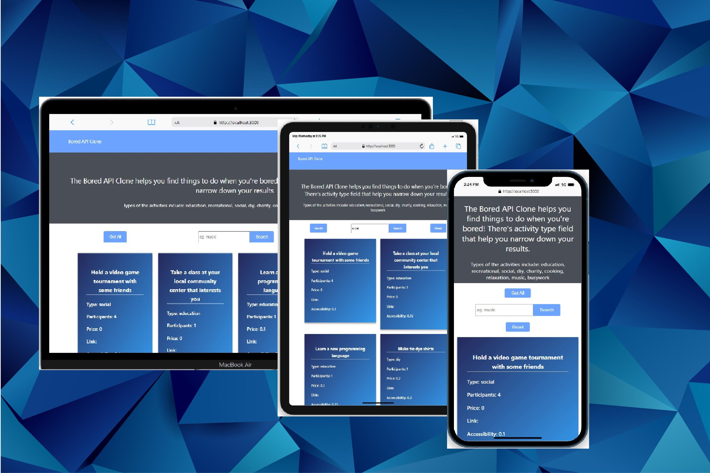

# MERN Bored Activity finder

This is a starter app for a MERN stack application. This is for a SPA (Single Page Application) workflow that uses the [Webpack] Build tool. 



It includes the following:

- Backend API with Express & MongoDB
- Routes for updating data and getting data from database
- React frontend to get activities

### Env Variables

Rename the `.env.example` file to `.env` and add the following

### Install Dependencies (frontend & backend)

```
npm install
cd frontend
npm install
```

### Run

```

# Run frontend (:3000) & backend (:5000)
npm run dev

# Run backend only
npm run server
```

## Build & Deploy

```
# Create frontend prod build
cd frontend
npm run build
```